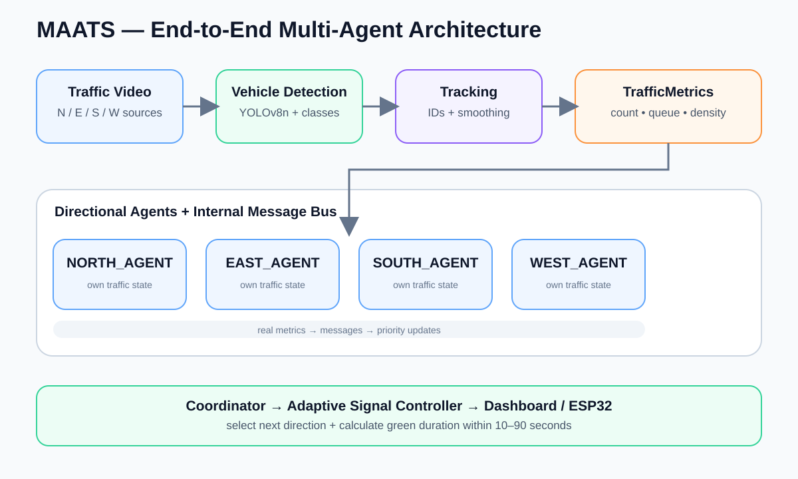
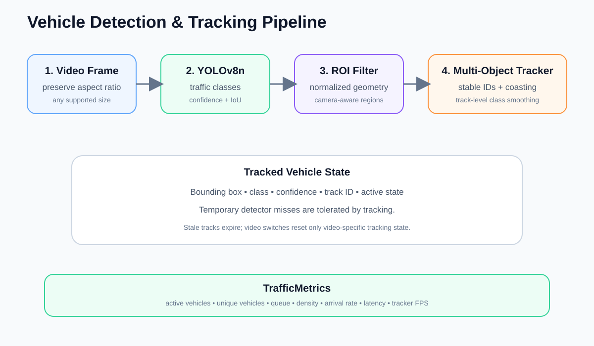
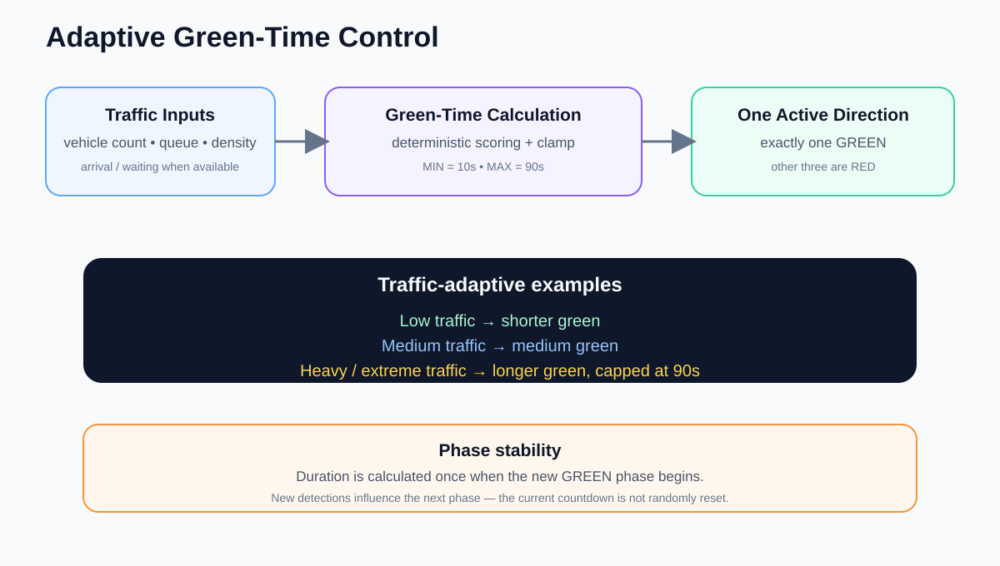
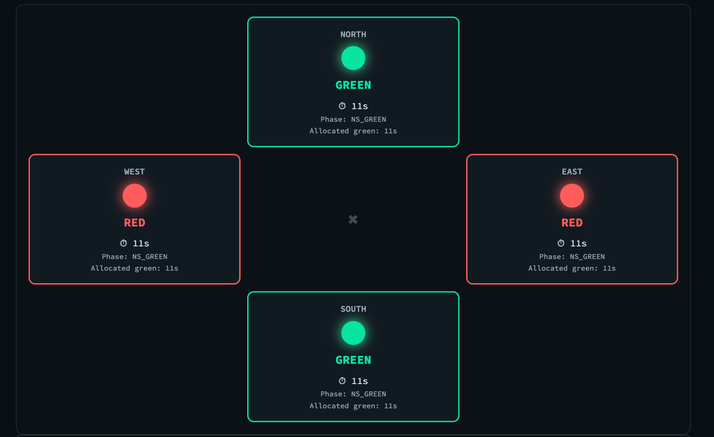

<div align="center">
  

  <p>
    <strong>Real-time vehicle detection • multi-agent traffic intelligence • adaptive signal timing</strong>
  </p>

  <p>
    <a href="https://github.com/mohithreddy-git/maats-multi-agent-traffic">Repository</a> ·
    <a href="#quick-start">Quick Start</a> ·
    <a href="#system-architecture">Architecture</a> ·
    <a href="#vehicle-detection-and-tracking">Vehicle Detection</a> ·
    <a href="#demo">Demo</a>
  </p>

  <p>
    
    
    
    
    
  </p>
</div>

# 🚦 MAATS

**Multi-Agent AI-Based Adaptive Traffic Signal Coordination and Traffic Clearance System**

MAATS is an intelligent traffic-control prototype that combines **real-time computer vision, multi-object tracking, autonomous directional agents, message-based coordination, and adaptive traffic-signal timing**.

Instead of treating an intersection as a single monolithic controller, MAATS models **North, East, South, and West as independent traffic agents**. Each agent observes its own traffic conditions, communicates those conditions to a coordinator, and contributes to a decision about **which direction should receive the next green phase and for how long**.

The system is designed for an evaluator-friendly workflow:

> **Traffic video → vehicle detection → tracking → traffic metrics → four agents → coordinator → adaptive green time → one safe green signal**

---

## ✨ Key Capabilities

| Capability | Description |
|---|---|
| 🎥 **Traffic Video Input** | Per-direction prerecorded traffic videos with runtime upload and switching support |
| 🚗 **Vehicle Detection** | YOLOv8n for real traffic footage with traffic-class filtering |
| 🧭 **Multi-Object Tracking** | Stable vehicle IDs, temporary-miss tolerance, stale-track expiry, track-level class smoothing |
| 📐 **Traffic Metrics** | Active/unique vehicles, queue, density, arrival information and detection latency |
| 🤖 **Multi-Agent Architecture** | Independent North/East/South/West directional agents plus a coordinator |
| 📡 **Message Bus** | Agents exchange real traffic state rather than relying on a single shared decision routine |
| 🧠 **Adaptive Green Time** | Green duration is calculated from the selected direction's current traffic conditions |
| ⏱️ **Signal Bounds** | Minimum green: **10 s**; maximum green: **90 s** |
| 🚦 **Safety FSM** | Exactly one direction can be GREEN; YELLOW and ALL-RED are enforced during transitions |
| 🖥️ **Streamlit Dashboard** | Traffic Vision, Multi-Agent Communication and Signal Control views |
| 🔌 **ESP32 Path** | Hardware-ready signal output through the safety-gated controller |
| 🧪 **Validation** | Full automated suite currently validated at **181/181 tests passing** |

---

## 🎯 Why MAATS?

Conventional fixed-time traffic control does not directly react to the traffic state visible at an intersection. MAATS instead creates a closed feedback loop in which **detected traffic influences agent state, agent state influences coordination, and coordination influences the next signal phase**.

The controller is adaptive without sacrificing signal safety:

- **Low traffic → shorter green**
- **Medium traffic → medium green**
- **Heavy traffic → longer green**
- **Extreme traffic → green capped at 90 seconds**
- **No usable video → deterministic 90-second fallback rotation**

The current green duration is calculated **once when the phase begins**. A new detection does not randomly reset the countdown in the middle of the active phase.

---

# 🏗️ System Architecture



### End-to-end flow

```text
                    ┌──────────────────────┐
                    │     Traffic Video    │
                    │ N / E / S / W source │
                    └──────────┬───────────┘
                               │
                               ▼
                    ┌──────────────────────┐
                    │  Vehicle Detection   │
                    │       YOLOv8n        │
                    └──────────┬───────────┘
                               │
                               ▼
                    ┌──────────────────────┐
                    │       Tracker        │
                    │ stable IDs + state   │
                    └──────────┬───────────┘
                               │
                               ▼
                    ┌──────────────────────┐
                    │   TrafficMetrics     │
                    │ count / queue /      │
                    │ density / arrival    │
                    └──────────┬───────────┘
                               │
          ┌────────────────────┼────────────────────┐
          ▼                    ▼                    ▼
       NORTH                EAST                  SOUTH ... WEST
       AGENT                 AGENT                 AGENT
          └────────────────────┼────────────────────┘
                               ▼
                    ┌──────────────────────┐
                    │      Message Bus     │
                    └──────────┬───────────┘
                               ▼
                    ┌──────────────────────┐
                    │     Coordinator      │
                    │ next direction +     │
                    │ adaptive duration   │
                    └──────────┬───────────┘
                               ▼
                    ┌──────────────────────┐
                    │     Signal FSM       │
                    │ GREEN → YELLOW →    │
                    │ ALL-RED → GREEN     │
                    └──────────┬───────────┘
                               ▼
                  ┌───────────────────────────┐
                  │ Streamlit / ESP32 Output  │
                  └───────────────────────────┘
```

---

# 🚗 Vehicle Detection & Tracking



MAATS uses a **real object-detection pipeline for real traffic footage** and keeps a lightweight motion-based fallback for synthetic square-object demo clips where an object detector is not expected to classify the shapes as real vehicles.

### Primary real-video pipeline

```text
Frame
 ↓
Orientation / aspect-preserving preprocessing
 ↓
YOLOv8n
 ↓
Vehicle-class filtering
 ↓
Confidence / IoU filtering
 ↓
ROI polygon filtering
 ↓
Multi-object tracking
 ↓
Track-level class smoothing
 ↓
TrafficMetrics
```

### Vehicle classes

The detector is restricted to relevant traffic classes such as:

- Car
- Motorcycle
- Bus
- Truck

Where appropriate, bicycle detection can also be enabled.

### Tracking behavior

The tracker is responsible for maintaining a vehicle's identity across frames instead of treating every detection as a brand-new vehicle.

It supports:

- stable track IDs while a vehicle remains visible;
- tolerance to brief detector misses;
- one-to-one detection assignment;
- stale-track expiry;
- video-switch tracker reset;
- track-level class smoothing to reduce CAR/TRUCK/BUS flicker;
- continuous tracking of stationary or stop-and-go traffic.

### Detection performance observed during validation

The current validated real-video runs produced approximately:

- **22–28 FPS** processing on the tested real traffic footage;
- **~33–42 ms** average detector latency;
- first useful detection ranging from approximately **0.05–1.3 s** on the tested normal landscape footage;
- real tracked vehicles with persistent IDs;
- external 1280×720 traffic footage successfully processed through the YOLO pipeline.

These are observed prototype measurements, **not a claim of universal detection accuracy**.

---

# 🤖 Multi-Agent Intelligence

MAATS uses four directional agents:

```text
┌─────────────┐     ┌─────────────┐
│ NORTH AGENT │     │  EAST AGENT  │
└──────┬──────┘     └──────┬──────┘
       │                   │
       └────────┬──────────┘
                ▼
        ┌───────────────┐
        │   COORDINATOR │
        └───────────────┘
                ▲
       ┌────────┴─────────┐
       │                  │
┌──────┴──────┐    ┌──────┴───────┐
│SOUTH AGENT  │    │  WEST AGENT  │
└─────────────┘    └──────────────┘
```

Each directional agent receives real traffic state for its direction, publishes its state over the internal message bus, and contributes to the coordinator's decision.

The coordinator determines:

1. **which direction should receive the next green slot;**
2. **how long that slot should remain green, based on that direction's own traffic metrics.**

This preserves the separation between **local observation** and **intersection-level coordination**.

---

# 🧠 Adaptive Green-Time Control



The controller no longer treats 90 seconds as the fixed duration of every green phase.

Instead:

```text
traffic metrics
      ↓
priority / selection
      ↓
next direction
      ↓
calculate green duration
      ↓
clamp to [10s, 90s]
      ↓
GREEN countdown
      ↓
YELLOW
      ↓
ALL RED
      ↓
next direction
```

The duration is determined from the selected direction's current:

- vehicle count;
- queue length;
- density;
- arrival/waiting information where available.

### Example behavior observed

| Traffic state | Observed condition | Example green duration |
|---|---:|---:|
| Light | 0–1 vehicles | 10–13 s |
| Medium | 2–3 vehicles, queue ≈ 2 | 16–19 s |
| Heavy | ≈ 6 vehicles, queue ≈ 2 | ≈ 34 s |
| Extreme | ≈ 19 vehicles, queue ≈ 5 | 90 s (maximum) |

The exact value depends on the live metrics and configured scoring function.

### Safety invariant

At any instant:

> **Exactly one direction may be GREEN.**

The signal controller is the final authority over the physical/dashboard state. If a corrupted command attempts to produce an unsafe state, the system fails safe to **ALL RED**.

---

# 🚦 Signal State Machine

```text
               ┌──────────────┐
               │ GREEN: N/E/S/W│
               └──────┬───────┘
                      │ timer = 0
                      ▼
               ┌──────────────┐
               │    YELLOW    │
               └──────┬───────┘
                      ▼
               ┌──────────────┐
               │   ALL RED    │
               └──────┬───────┘
                      ▼
               ┌──────────────┐
               │ NEXT GREEN   │
               └──────────────┘
```

### Invariants

- Never two simultaneous green signals.
- Current green phase is not arbitrarily interrupted by a new vehicle observation.
- Green duration remains within the configured minimum/maximum bounds.
- Video switching does not reset the active signal phase.
- Invalid input fails safely rather than generating contradictory signal states.

---

# 🖥️ Dashboard

MAATS exposes three primary evaluation views.

## 1. Traffic Vision

Shows the live traffic source and computer-vision state, including vehicle bounding boxes, tracking IDs, confidence, counts and processing information.

**Typical evaluator question answered:**
> “Can I actually see the system detecting the vehicles?”

## 2. Multi-Agent Communication

Shows directional agent state, traffic metrics, message flow and the coordinator's next-direction decision.

**Typical evaluator question answered:**
> “Where is the multi-agent intelligence happening?”

## 3. Signal Control

Shows the current direction, signal state, adaptive duration, countdown and the other three directions.

**Typical evaluator question answered:**
> “How does the traffic information change the signal?”

### Signal Control snapshot



---

# 🎬 Recommended Demo Flow

A concise demonstration can follow this sequence:

### Step 1 — Show Traffic Vision

Start with a real traffic video.

Show:

- vehicle bounding boxes;
- track IDs;
- current vehicle count;
- live traffic conditions.

### Step 2 — Show the four agents

Move to **Multi-Agent Communication**.

Explain that the traffic observed in each direction is converted into directional agent state and sent to the coordinator.

### Step 3 — Show adaptive timing

Move to **Signal Control**.

Example:

```text
LOW TRAFFIC
→ shorter green

HEAVY TRAFFIC
→ longer green

EXTREME TRAFFIC
→ capped at 90s
```

### Step 4 — Switch the input video

Change one direction's video source while the application is running.

The detector/tracker updates for the new video while the active signal phase remains under the SignalFSM's control.

### Step 5 — Demonstrate safety

Show that only one direction is green and the remaining directions stay red.

---

# 🚀 Quick Start

## Prerequisites

- Python 3.x
- pip
- Git
- a machine capable of running the selected computer-vision model locally

## Clone

```bash
git clone https://github.com/mohithreddy-git/maats-multi-agent-traffic.git
cd maats-multi-agent-traffic
```

## Create a virtual environment

### macOS / Linux

```bash
python3 -m venv .venv
source .venv/bin/activate
```

### Windows

```powershell
python -m venv .venv
.venv\Scripts\activate
```

## Install dependencies

```bash
pip install -r requirements.txt
```

## Run the dashboard

```bash
streamlit run dashboard.py
```

Open the local Streamlit URL shown in the terminal, typically:

```text
http://localhost:8501
```

---

# 📁 Repository Structure

```text
maats-multi-agent-traffic/
├── backend/
│   ├── agents/              # directional agents + coordinator
│   ├── cv/                  # detection, tracking and video processing
│   ├── hardware/            # ESP32 / signal output safety gate
│   └── traffic_engine/      # scoring, metrics and SignalFSM
├── data/
│   └── traffic/             # intentional demo traffic assets
├── scripts/                 # utilities / demo preparation
├── tests/                   # unit + integration + safety tests
├── dashboard.py             # Streamlit application
├── requirements.txt         # Python dependencies
├── .gitignore
└── README.md
```

---

# 🧪 Validation

The current development validation reports:

- **181/181 automated tests passing** after adaptive green-time integration;
- real-video YOLOv8n runs at approximately **22–28 FPS** on tested footage;
- observed detector latency of approximately **33–42 ms** on tested real footage;
- video switching verified without resetting the active SignalFSM phase;
- no-video fallback verified as **North → East → South → West** with 90-second green phases;
- single-green invariant verified over extended simulated and real-time monitoring;
- adaptive green-time behavior verified across low, medium, heavy and extreme traffic conditions;
- track-level class smoothing reduced observed class-label transitions substantially on the tested footage.

These figures represent the tested prototype environment and should not be interpreted as universal benchmark guarantees.

---

# ⚠️ Known Limitations

The project is a demonstrable prototype rather than a production traffic-management deployment.

Known limitations include:

- Real-world vehicle-detection quality varies with camera angle, lighting, occlusion, vehicle scale and video quality.
- Rotated/portrait footage can require orientation-aware preprocessing; this is a known area for further hardening.
- CPU-only YOLO inference can be slower than GPU inference.
- Synthetic square-object demo clips may use the MotionDetector fallback instead of real vehicle classification.
- Physical ESP32 hardware was not continuously attached during software validation.
- Long-running sessions can accumulate the project's cumulative unique-track set by design.

No claim is made that the system achieves perfect vehicle detection or universal camera compatibility.

---

# 🔐 Safety and Reliability Design

The implementation deliberately keeps signal safety inside the signal controller rather than trusting upstream components.

Key safeguards include:

- a single canonical green-state assertion;
- fail-safe ALL-RED handling for corrupted commands;
- isolated agent/source exceptions;
- tracker reset on video switching;
- detector model reuse without unnecessary reloads;
- bounded signal timing;
- no mid-phase interruption caused by new traffic observations;
- explicit YELLOW and ALL-RED transitions.

---

# 🛣️ Future Extensions

Potential production-oriented extensions include:

- GPU-backed inference and stronger detectors/trackers;
- camera calibration and automatic road-scene/ROI calibration;
- multi-junction coordination;
- MQTT or equivalent field communication;
- authenticated operator access;
- historical traffic analytics;
- cloud deployment;
- advanced predictive or reinforcement-learning controllers;
- stronger hardware failover and field safety certification.

These are future directions and are **not represented as live capabilities of the current prototype**.

---

# 📚 Technical References

The computer-vision and traffic-control design was informed by open-source traffic-detection and adaptive-signal implementations, including:

- [vehicle_counting_tensorflow](https://github.com/ahmetozlu/vehicle_counting_tensorflow)
- [Traffic_signal_counter_using_car_count_python](https://github.com/jambhaleAnuj/Traffic_signal_counter_using_car_count_python)
- [Adaptive-Traffic-Lights](https://github.com/DanielMusau/Adaptive-Traffic-Lights)

These repositories were used as technical references for concepts such as vehicle detection, tracking, traffic-density estimation and adaptive signal control. The MAATS implementation should be reviewed independently for its own code and licensing obligations.

---

# 📌 Project Status

**Status:** Demo-ready prototype

**Primary objective:** Demonstrate how real-time vehicle intelligence and autonomous directional agents can drive adaptive signal timing while preserving a strict one-green safety invariant.

---

<div align="center">

### 🚦 Detect. Communicate. Decide. Adapt.

**MAATS — Multi-Agent AI-Based Adaptive Traffic Signal Coordination and Traffic Clearance System**

</div>
