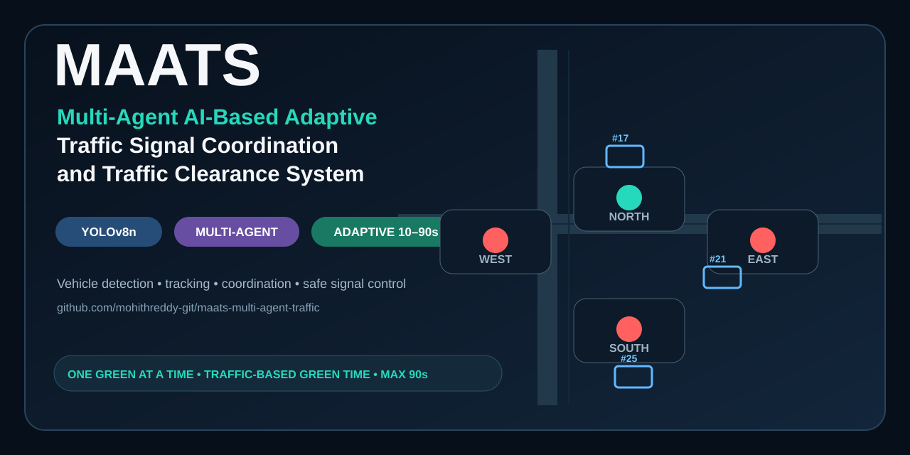
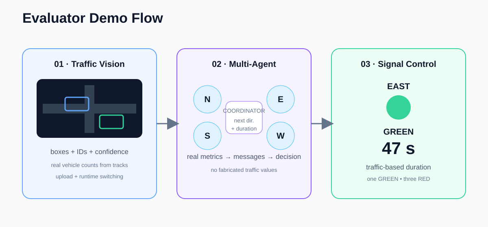

<div align="center">
  

  <h1>MAATS</h1>
  <p><strong>Multi-Agent AI-Based Adaptive Traffic Signal Coordination and Traffic Clearance System</strong></p>
  <p>
    Real-time vehicle detection • multi-object tracking • directional agents • adaptive green-time control • safe single-green signal control
  </p>

  <p>
    <a href="https://github.com/mohithreddy-git/maats-multi-agent-traffic">Repository</a> ·
    <a href="#quick-start">Quick Start</a> ·
    <a href="#system-architecture">Architecture</a> ·
    <a href="#vehicle-detection-and-tracking">Detection &amp; Tracking</a> ·
    <a href="#adaptive-signal-control">Adaptive Signal Control</a> ·
    <a href="#demo-flow">Demo</a>
  </p>

  <p>
    
    
    
    
    
    
  </p>
</div>

---

## 🚦 Overview

**MAATS** is a multi-agent traffic-signal coordination prototype that combines **computer vision, multi-object tracking, directional traffic agents, message-based coordination, adaptive green-time calculation, and a safety-gated signal state machine**.

The central idea is to turn each approach of an intersection into an autonomous traffic agent:

- **North Agent** observes North-side traffic.
- **East Agent** observes East-side traffic.
- **South Agent** observes South-side traffic.
- **West Agent** observes West-side traffic.
- A **Coordinator Agent** receives those traffic states and determines the next direction to serve.
- The **Signal FSM** remains the final authority over the physical/dashboard signal state.

The resulting loop is:

> **Traffic Video → Vehicle Detection → Tracking → Traffic Metrics → Directional Agents → Message Bus → Coordinator → Adaptive Green Time → Safe Signal Control**

---

## ✨ Why MAATS?

Traditional fixed-time signal control can allocate the same amount of green time even when the traffic state is very different from one approach to another. MAATS instead uses observed traffic conditions to determine **which direction should receive the next green phase and how long that phase should last**, while preserving a strict safety invariant:

> **Exactly one direction can be GREEN at any instant.**

The controller adapts duration within configured bounds:

**Low traffic → shorter green**  
**Medium traffic → medium green**  
**Heavy traffic → longer green**  
**Extreme traffic → up to the 90-second ceiling**

For the no-video/no-metrics fallback, the controller uses a deterministic 90-second rotation:

**North → East → South → West → repeat**

---

## 🧩 Key Capabilities

| Capability | Implementation |
|---|---|
| 🎥 Traffic video input | Per-direction prerecorded video, upload and runtime switching |
| 🚗 Vehicle detection | YOLOv8n with traffic-class filtering |
| 🧭 Multi-object tracking | Stable IDs, temporary-miss tolerance, stale-track expiry, track-level class smoothing |
| 📐 Traffic metrics | Vehicle count, unique vehicles, queue, density, arrival information and latency metrics |
| 🤖 Multi-agent system | Independent North/East/South/West agents + coordinator |
| 📡 Message bus | Real traffic state and coordination messages between agents |
| 🧠 Adaptive green time | Per-phase duration calculated from the selected direction's live traffic metrics |
| ⏱️ Timing bounds | **10 s minimum / 90 s maximum** |
| 🚦 Safety FSM | One active direction, YELLOW and ALL-RED transition protection |
| 🖥️ Dashboard | Traffic Vision, Multi-Agent Communication and Signal Control views |
| 🔌 Hardware path | Safety-gated ESP32/LED signal output path |
| 🧪 Validation | Latest reported automated suite: **181/181 tests passing** |

---

## 🏗️ System Architecture


### Architecture at a glance

```text
                   ┌──────────────────────┐
                   │    Traffic Video    │
                   │   N / E / S / W     │
                   └──────────┬───────────┘
                              │
                              ▼
                   ┌──────────────────────┐
                   │  Vehicle Detection   │
                   │       YOLOv8n        │
                   └──────────┬───────────┘
                              │
                              ▼
                   ┌──────────────────────┐
                   │       Tracker        │
                   │ IDs + track state    │
                   └──────────┬───────────┘
                              │
                              ▼
                   ┌──────────────────────┐
                   │    TrafficMetrics    │
                   │ count / queue /      │
                   │ density / arrival    │
                   └──────────┬───────────┘
                              │
            ┌─────────────────┼─────────────────┐
            ▼                 ▼                 ▼
        NORTH AGENT        EAST AGENT       SOUTH AGENT ... WEST
            └─────────────────┼─────────────────┘
                              ▼
                   ┌──────────────────────┐
                   │      Message Bus     │
                   └──────────┬───────────┘
                              ▼
                   ┌──────────────────────┐
                   │     Coordinator      │
                   │ next direction +     │
                   │ green duration       │
                   └──────────┬───────────┘
                              ▼
                   ┌──────────────────────┐
                   │      Signal FSM      │
                   │ one GREEN only      │
                   └──────────┬───────────┘
                              ▼
                   ┌──────────────────────┐
                   │ Dashboard / ESP32    │
                   └──────────────────────┘
```

---

## 🚘 Vehicle Detection & Tracking


### Detection pipeline

MAATS uses **YOLOv8n** as the primary vehicle detector for real traffic footage. The pipeline is designed around the separation of detection, tracking and traffic-state extraction:

1. Decode the video frame.
2. Preserve aspect ratio during preprocessing.
3. Run vehicle-focused object detection.
4. Apply confidence/class filtering.
5. Apply the direction-specific ROI.
6. Track detections across frames.
7. Smooth vehicle class labels across the track.
8. Convert live tracks into `TrafficMetrics`.

### Vehicle classes

The detector is configured around traffic-relevant classes such as:

- car
- motorcycle
- bus
- truck

### Tracking behavior

The tracker is responsible for maintaining an identity over time rather than treating every frame as a brand-new set of vehicles.

The implementation includes:

- stable track IDs;
- one-to-one assignment;
- tolerance for brief detector misses;
- stale-track expiry;
- tracker reset when switching to a new video;
- track-level class smoothing to reduce CAR/TRUCK/BUS label flicker;
- traffic counts derived from live tracks rather than fabricated values.

### Synthetic demo-video fallback

Some supplied demo clips use synthetic square objects rather than realistic vehicles. Those clips can use the project's motion-detection fallback because a normal object detector cannot reliably classify arbitrary synthetic squares as real cars.

Real traffic footage uses the YOLO-based primary pipeline.

---

## 🧠 Adaptive Signal Control


The signal controller separates **direction selection** from **phase duration**.

### Direction selection

The four agents publish their traffic state. The coordinator evaluates the current information and chooses the direction that should receive the **next** green phase.

### Green duration

The selected direction receives a traffic-dependent green duration calculated from its own live metrics, including the available vehicle-count, queue and density signals.

The duration is bounded by:

```text
MIN_GREEN = 10 seconds
MAX_GREEN = 90 seconds
```

The duration is calculated **once when the phase begins**. New observations affect the next phase rather than randomly rewriting the active countdown in the middle of the current phase.

### Example behavior

| Traffic condition | Example outcome |
|---|---:|
| Light | 10–20 s range |
| Medium | Medium-duration phase |
| Heavy | Longer phase |
| Extreme | Up to 90 s ceiling |
| No usable video | 90 s deterministic fallback |

The live validation reported the following progression across independent runs:

| Source | Observed traffic | Calculated green |
|---|---:|---:|
| `light.mp4` | 0–1 vehicles | 10–13 s |
| `medium.mp4` | 2–3 vehicles, queue 2 | 16–19 s |
| `heavy.mp4` | 6 vehicles, queue 2 | 34 s |
| Real external footage | 19 vehicles, queue 5 | 90 s ceiling |

These values are runtime observations from the project validation, not hard-coded demonstration values.

---

## 🚦 Signal Safety Model

A central safety requirement is enforced throughout the dashboard and hardware-output paths:

```text
At every instant:

GREEN directions ≤ 1

During GREEN:
    GREEN directions = 1

During YELLOW / ALL-RED:
    GREEN directions = 0
```

The phase sequence is:

```text
GREEN(current direction)
        ↓
YELLOW(current direction)
        ↓
ALL RED
        ↓
GREEN(next direction)
```

A new traffic decision cannot simply switch another direction to GREEN in the middle of an active phase.

The signal controller is the final authority on timing and safe output state.

---

## 🎬 Demo Flow



The recommended evaluator sequence is:

### 01 — Traffic Vision

Show a live traffic video with:

- vehicle bounding boxes;
- track IDs;
- class labels;
- confidence;
- active vehicle count;
- traffic metrics.

### 02 — Multi-Agent Communication

Move to the communication view and show:

- North/East/South/West agent state;
- actual traffic metrics flowing from the CV pipeline;
- inter-agent messages;
- coordinator decision;
- selected next direction;
- calculated green duration.

### 03 — Signal Control

Show:

- exactly one GREEN direction;
- three RED directions;
- active countdown;
- selected traffic direction;
- calculated green duration and reason.

A real Signal Control screenshot from the project is included below.

<p align="center">
  
</p>

---

## 🔄 Video Upload & Runtime Switching

The application supports runtime traffic-video switching without resetting the active signal FSM.

Typical evaluator sequence:

```text
Medium video
    ↓
Heavy video
    ↓
Light video
    ↓
External uploaded traffic video
```

During a switch:

- the old video capture is released;
- the direction's tracker state is reset;
- the detector model remains cached;
- old bounding boxes/IDs are cleared;
- new video metrics begin flowing;
- the current signal direction and active countdown remain intact.

This allows an evaluator to request a different traffic source during the demonstration without restarting the entire application.

---

## 🖥️ Dashboard Views

### Traffic Vision

The computer-vision view is designed to answer:

> **What vehicles are actually being detected and tracked?**

### Multi-Agent Communication

The coordination view is designed to answer:

> **How do four directional agents communicate their traffic state, and what does the coordinator decide?**

### Signal Control

The signal view is designed to answer:

> **Which direction is currently green, how long is its adaptive phase, and are the other directions safely held at red?**

---

## ⚡ Quick Start

### 1. Clone the repository

```bash
git clone https://github.com/mohithreddy-git/maats-multi-agent-traffic.git
cd maats-multi-agent-traffic
```

### 2. Create a virtual environment

macOS / Linux:

```bash
python3 -m venv .venv
source .venv/bin/activate
```

Windows PowerShell:

```powershell
python -m venv .venv
.\.venv\Scripts\Activate.ps1
```

### 3. Install dependencies

```bash
pip install -r requirements.txt
```

### 4. Start the dashboard

```bash
streamlit run dashboard.py
```

Then open the local Streamlit URL shown in the terminal, normally:

```text
http://localhost:8501
```

---

## 🧪 Run the Test Suite

Run the complete test suite with the project's configured test runner. A typical invocation is:

```bash
pytest -q
```

Latest reported validation:

```text
181 passed, 0 failed
```

The validation covered adaptive timing, timing bounds, single-green safety, video switching, coordinator behavior, real metric flow, failure isolation and dashboard-related regression cases.

---

## 📊 Real-Video Validation Snapshot

The project was tested against supplied demo clips and external real traffic footage.

| Input | Resolution / FPS | Detector | Avg latency | Processing FPS | Observation |
|---|---|---|---:|---:|---|
| Empty | 640×480 / 30 | Motion fallback | ~1.8 ms | ~381 | No false vehicles observed |
| Light | 640×480 / 30 | Motion fallback | ~2.0 ms | ~308 | Stable synthetic demo |
| Medium | 640×480 / 30 | Motion fallback | ~2.0 ms | ~304 | Stable synthetic demo |
| Heavy | 640×480 / 30 | Motion fallback | ~2.1 ms | ~278 | Minor synthetic edge-wrapping ID churn |
| External real video | 1280×720 / 25 | YOLOv8n | ~33.3 ms | ~28.4 FPS | Stable sampled real tracks |
| External real video | 1280×720 / 50 | YOLOv8n | ~41.9 ms | ~22.9 FPS | Stable stop-and-go tracking observed |

These are measured validation values from the project run, not theoretical benchmarks.

---

## 🧱 Project Structure

```text
maats-multi-agent-traffic/
│
├── backend/
│   ├── agents/              # directional agents + coordinator
│   ├── cv/                  # detection, tracking, video adapters
│   ├── hardware/            # ESP32 / LED safety-gated output
│   ├── traffic_engine/      # scoring, timing, signal FSM
│   └── ...
│
├── data/
│   └── traffic/             # intentional demo video assets
│
├── scripts/                 # utilities / demo-data helpers
├── tests/                   # unit + integration + regression tests
├── dashboard.py             # Streamlit application
├── requirements.txt
├── .gitignore
└── README.md
```

---

## 🔌 Hardware Integration

The architecture includes an ESP32/LED signal-output path.

The software safety boundary validates the requested signal state before it is sent to the hardware layer. During the documented validation session, no physical ESP32 was connected, so the hardware path was validated through software tests rather than an attached physical junction.

---

## 🧯 Failure Handling

MAATS is designed to fail safely rather than fabricate traffic information.

Handled scenarios include:

- malformed video frames;
- empty detection results;
- detector exceptions;
- invalid video paths;
- end-of-video conditions;
- video switching;
- temporary detection misses;
- Streamlit reruns;
- malformed agent messages.

The signal controller remains the final safety boundary.

---

## 🌐 Real-World Input Notes

The project is intended to accept different traffic-video dimensions and aspect ratios, with aspect-preserving preprocessing and direction-specific ROI handling.

A known limitation remains for some **genuinely rotated/portrait real-world footage**, where the detector can lose useful detections because the visual orientation differs from normal landscape traffic footage. This is documented rather than hidden.

The project also contains synthetic demo clips. Those use the project's explicit motion-detection fallback when a conventional vehicle detector would not be able to interpret the synthetic objects as real road vehicles.

---

## 🔬 Engineering Principles

MAATS follows several design principles:

**Separation of concerns**  
Detection, tracking, traffic metrics, agents, coordination and signal output remain separate layers.

**Single source of truth for signal state**  
The Signal FSM owns the active direction and final timing bounds.

**Real metrics over fabricated demo data**  
Vehicle counts and traffic summaries originate from the CV pipeline where video input is available.

**Adaptive, not chaotic, timing**  
Traffic changes affect future phase decisions; the active countdown is not continuously rewritten.

**Defensive safety gates**  
Dashboard and hardware outputs pass through the same single-green invariant.

**Demo reliability first**  
Video switching, malformed inputs and agent exceptions are isolated so one local failure does not unnecessarily freeze the complete pipeline.

---

## 🗺️ Roadmap

Possible future production extensions include:

- multi-junction coordination;
- direct real-time camera/RTSP feeds;
- stronger camera-motion handling;
- more advanced re-identification for long occlusions;
- edge deployment and GPU acceleration;
- MQTT or other inter-junction transport;
- richer historical traffic analytics;
- reinforcement-learning comparison experiments;
- authenticated remote hardware control;
- production observability and telemetry.

These are future extensions and are not represented as already-live functionality in the current prototype.

---

## 📚 Technical References

The implementation and design study referenced the following public projects:

- [vehicle_counting_tensorflow — ahmetozlu](https://github.com/ahmetozlu/vehicle_counting_tensorflow)
- [Traffic_signal_counter_using_car_count_python — jambhaleAnuj](https://github.com/jambhaleAnuj/Traffic_signal_counter_using_car_count_python)
- [Adaptive-Traffic-Lights — DanielMusau](https://github.com/DanielMusau/Adaptive-Traffic-Lights)

The MAATS repository should be treated as its own implementation; third-party code and licensing requirements should be respected separately from the architectural ideas referenced above.

---

## 👥 Project

**MAATS — Multi-Agent AI-Based Adaptive Traffic Signal Coordination and Traffic Clearance System**

GitHub: **https://github.com/mohithreddy-git/maats-multi-agent-traffic**

---

<div align="center">
  <sub>Built as an engineering prototype demonstrating computer vision, multi-agent coordination, adaptive traffic control and safety-oriented signal-state management.</sub>
</div>
